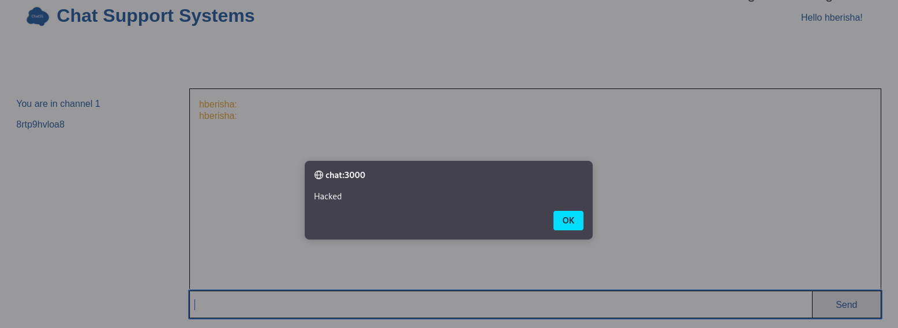

# XSS Attacks

## 1. Simple XSS Vulnerability
With the `ChatSupportNode` virtual machine on - on the other virtual machine using Kali Linux, let's visit `chat:3000` and register an account.

After logging in, visit `Chat` tab.

When sending a message in the chat `` we see an alert popping up, which means there is a XSS vulnerability.

